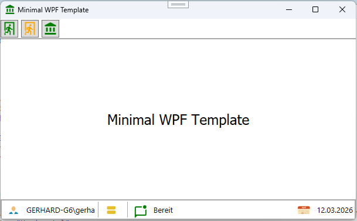

# MinimalWPF Projekt Template


]

Dieses Projekt ist ein einfaches WPF-Projekt Template für .NET 10.0, das die grundlegenden Komponenten für den Start einer WPF-Anwendung enthält. Es ist ideal für Entwickler, die schnell mit der Entwicklung von WPF-Anwendungen beginnen möchten.


# Features des Template
## WindowBase

```xml
<base:WindowBase
    x:Class="MinimalWPF.MainWindow"
    xmlns="http://schemas.microsoft.com/winfx/2006/xaml/presentation"
    xmlns:x="http://schemas.microsoft.com/winfx/2006/xaml"
    xmlns:base="clr-namespace:System.Windows"
    xmlns:d="http://schemas.microsoft.com/expression/blend/2008"
    xmlns:local="clr-namespace:MinimalWPF"
    xmlns:mc="http://schemas.openxmlformats.org/markup-compatibility/2006"
    Title="{Binding Path=WindowTitel, FallbackValue=~WindowTitel}"
    Width="900"
    Height="600"
    Icon="{StaticResource ResourceKey=IconCustomA2}"
    mc:Ignorable="d">

    <Grid x:Name="gridMain">

    </Grid>
</base:WindowBase>
```

## CommandBase

```csharp
public MainWindow()
{
    this.QuitCommand = new CommandBase(this.OnQuit);
}

public CommandBase QuitCommand { get; private set; }

private void OnQuit()
{
    this.Tag = null;
    this.Close();
}
```

## StatusbarMain

```xml
<!--#region Statuszeile-->
<StatusBar
    Grid.Row="2"
    Height="Auto"
    Background="Transparent"
    BorderBrush="DarkGray"
    BorderThickness="2"
    DataContext="StatusMain"
    FontSize="13">

    <StatusBarItem DockPanel.Dock="Left">
        <StackPanel Orientation="Horizontal">
            <Label Content="{StaticResource ResourceKey=IconStatusbarUser}" />
            <TextBlock
                Margin="5,0,0,0"
                VerticalAlignment="Center"
                Text="{Binding Path=CurrentUser, Source={x:Static base:StatusbarMain.Statusbar}}" />
        </StackPanel>
    </StatusBarItem>
</StatusBar>
<!--#endregion Statuszeile-->
```

Ändern eines Eintrags in der Statusleiste:
```csharp
StatusbarMain.Statusbar.CurrentDatabase = "Keine";
```

# Beispielsource
```csharp

```

